<a name="readme-top"></a>

[![Contributors][contributors-shield]][contributors-url]
[![Forks][forks-shield]][forks-url]
[![Stargazers][stars-shield]][stars-url]
[![Issues][issues-shield]][issues-url]
[![MIT License][license-shield]][license-url]
[![LinkedIn][linkedin-shield]][linkedin-url]


<br />
<div align="center">
  <h3 align="center">Jarvis</h3>

  <p align="center">
    Jarvis is a private AI assistant that allows you to conduct conversations in written and full voice form.
    Jarvis is connected to the user's private data and can perform tasks, e.g. setting meetings in Google Calendar
    <br />
    <br />
    <a href="https://github.com/DEENUU1/jarvis-backend/issues">Report Bug</a>
    ·
    <a href="https://github.com/DEENUU1/jarvis-backend/issues">Request Feature</a>
  </p>
</div>

## System Architecture

Jarvis consists of 2 repositories:

- Desktop https://github.com/DEENUU1/jarvis-desktop
- Core/Backend (current)

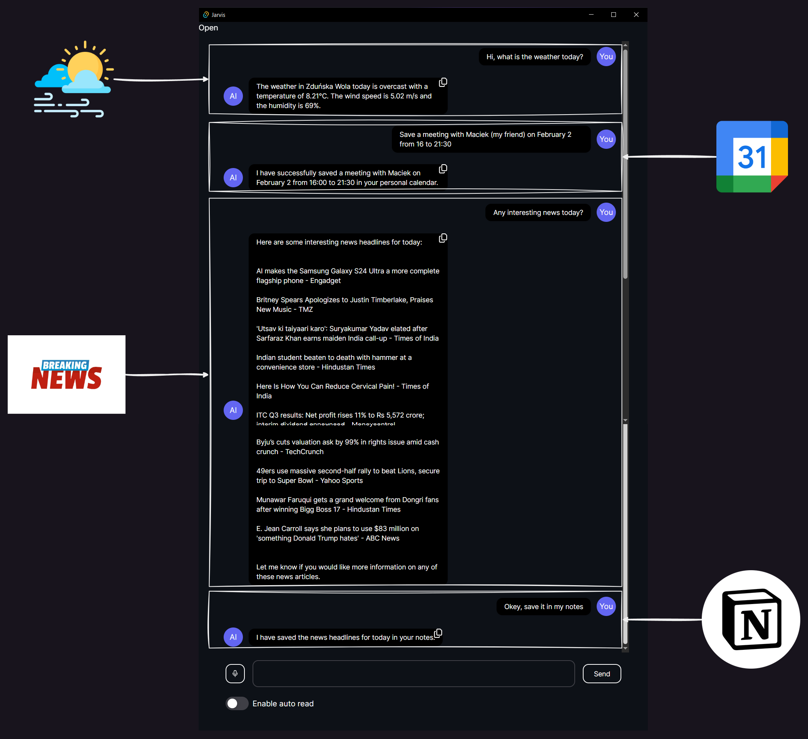

https://github.com/DEENUU1/jarvis-backend/assets/111304236/fe0b986d-07ab-45d0-a041-3ab54addb61b

### System architecture
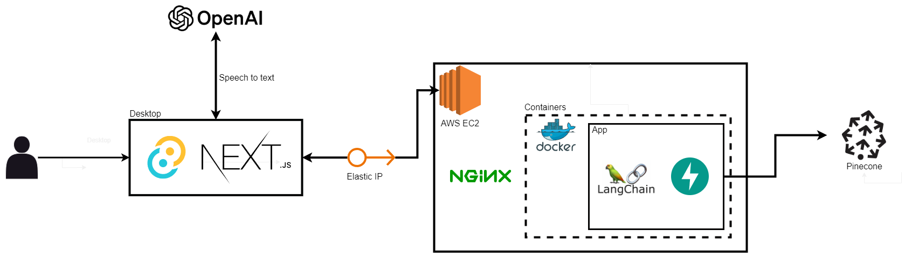

### How agent works
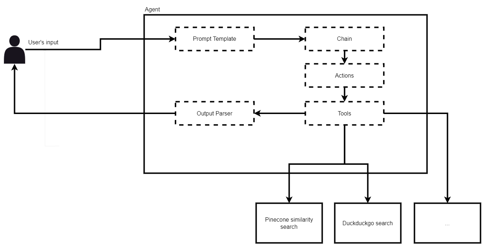

### How embedding works
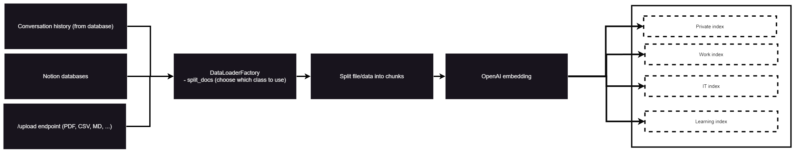

## Features

- Access on multiple devices - the application backend is hosted on an **AWS EC2** instance, so in the future, in addition
  to the Desktop application, it will also be possible to create a mobile application.
- Conversation history saved in SQLite database
- RAG by saving conversation history to a vector database (**Pinecone**), as well as the ability to import data from files
  in various formats and saving data from multiple databases with Notion
- Integration with **make.com**, currently used to support **Google calendar** and create notes in **Notion**
- Agent integration with the **Duckduckgo** search engine, **weather** data, **current date**, **news**, **wikipedia**
- Possibility of **voice conversation** with the assistant by using Whisper to transcribe audio into text
- Ability to convert **text to speech** to read AI responses

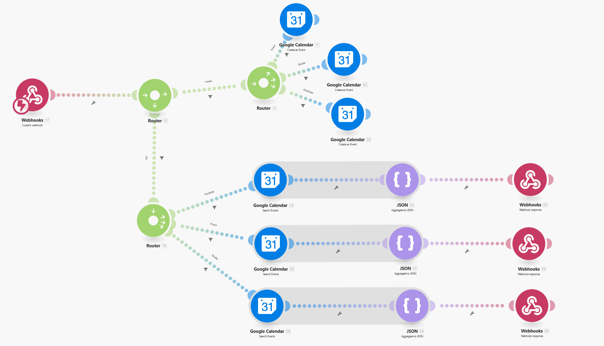
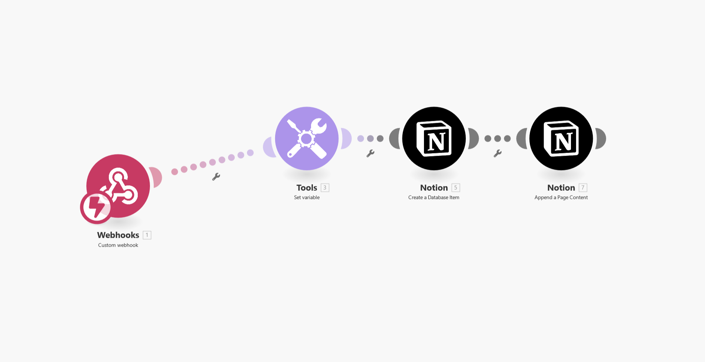

## Technologies:

#### Backend

- Python
    - Langchain
    - FastAPI
- AWS
    - EC2
    - ElasticIP
- Databases:
    - Pinecone (vector)
    - SQLite (history of conversations)
- Docker
- Docker-compose
- Nginx
- Make.com

#### Desktop

- Rust
    - Tauri
- Typescript
- React
    - Next.js

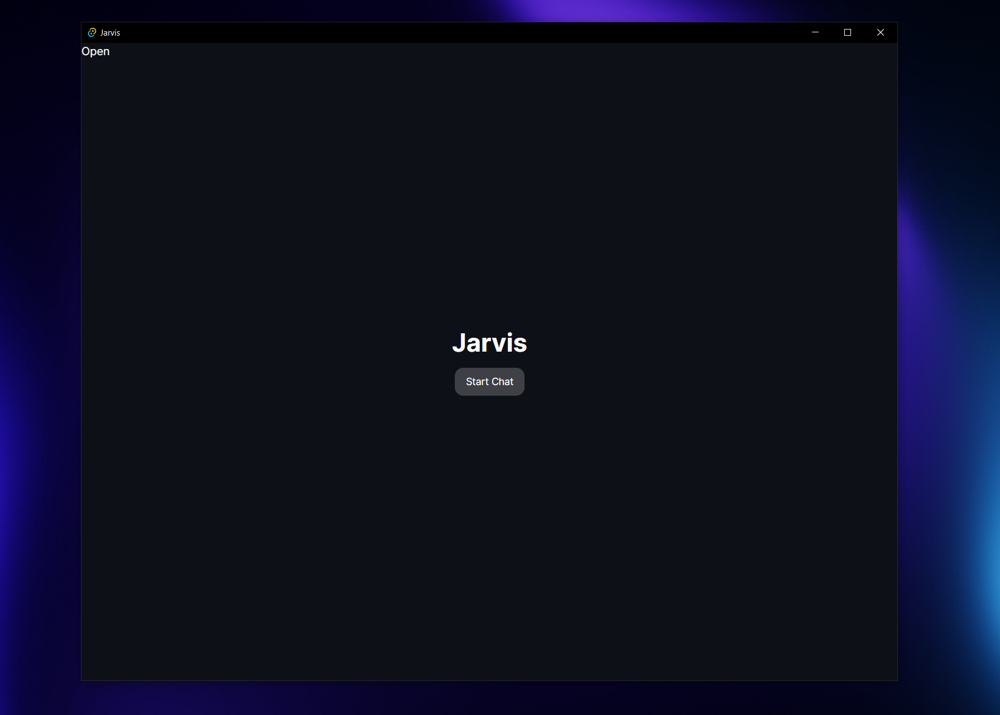
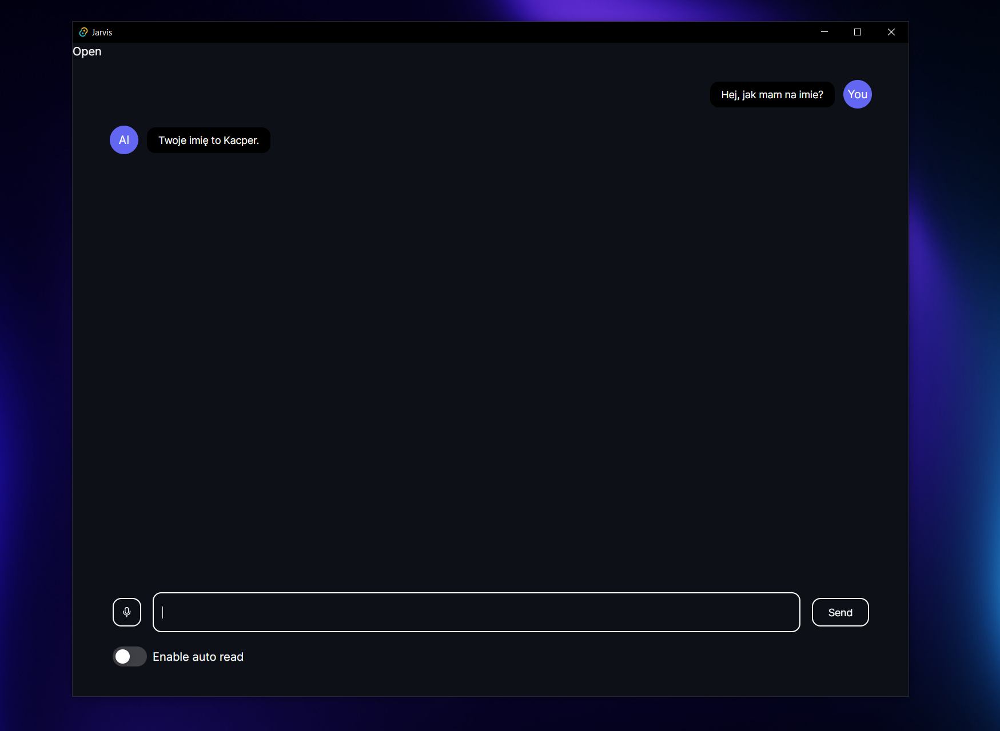
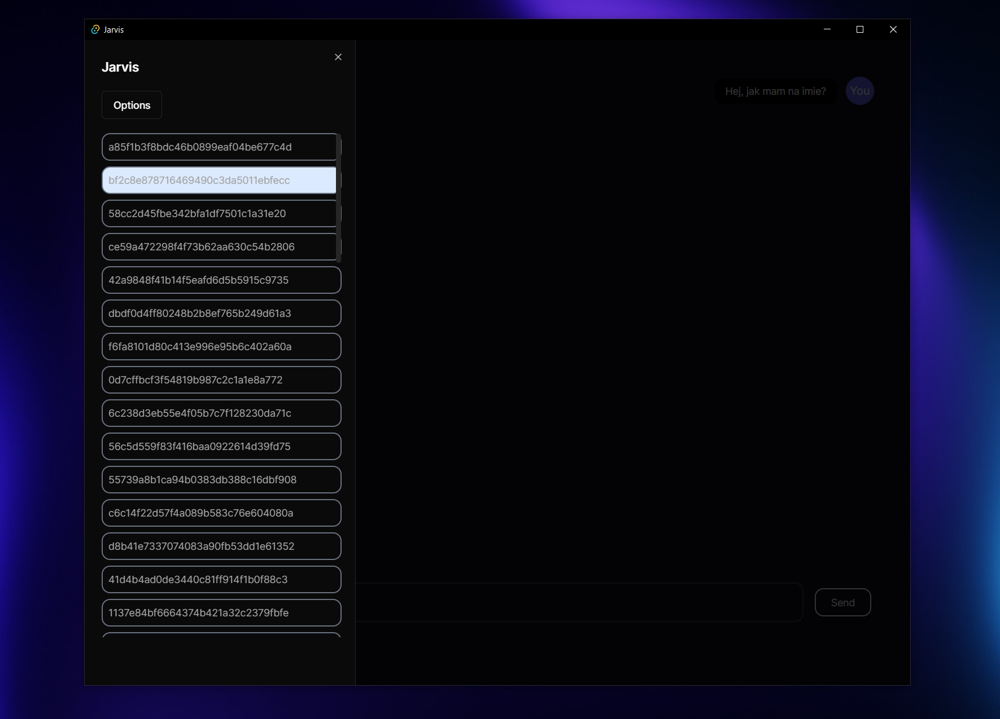
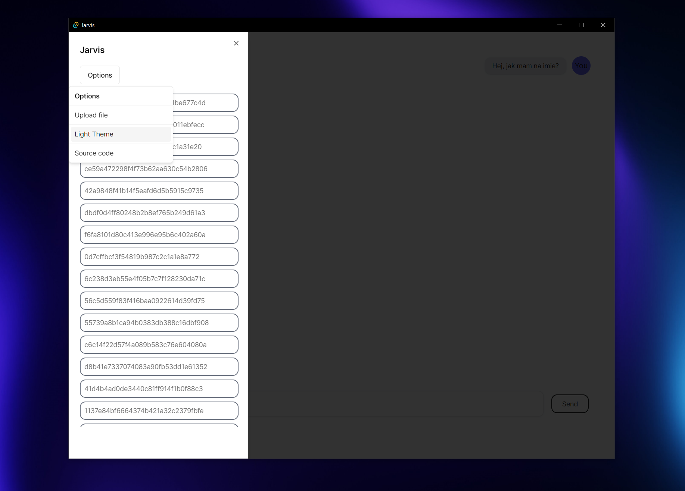
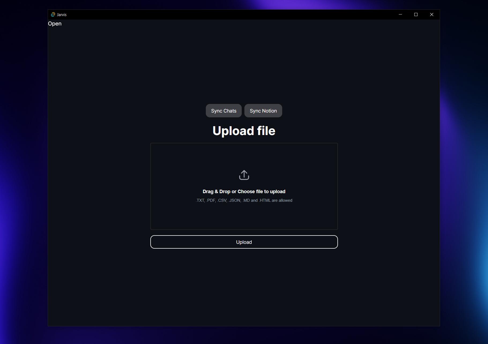

## Installation

### Backend

1. Clone repository

```bash
git clone https://github.com/DEENUU1/jarvis-backend.git
```

2. Create .env file

```bash
cp .env_example .env
```

3. Run docker-compose

```bash
docker-compose build
docker-compose up
```

### Desktop

1. Clone repository

```bash
git clone https://github.com/DEENUU1/jarvis-desktop.git
```

2. Change directory

```bash
cd jarvis
```

3. Create .env.local file

```bash
cp .env.local_example .env.local
```

4. Install packages

```bash
npm i
```

5. Build app

```bash
npm run tauri dev
```

### Other
In ./blueprint directory u can find all blueprints which I made in make.com

## Authors

- [@DEENUU1](https://www.github.com/DEENUU1)

<!-- LICENSE -->

## License

See `LICENSE.txt` for more information.


<!-- MARKDOWN LINKS & IMAGES -->
<!-- https://www.markdownguide.org/basic-syntax/#reference-style-links -->

[contributors-shield]: https://img.shields.io/github/contributors/DEENUU1/jarvis-backend.svg?style=for-the-badge

[contributors-url]: https://github.com/DEENUU1/jarvis-backend/graphs/contributors

[forks-shield]: https://img.shields.io/github/forks/DEENUU1/jarvis-backend.svg?style=for-the-badge

[forks-url]: https://github.com/DEENUU1/jarvis-backend/network/members

[stars-shield]: https://img.shields.io/github/stars/DEENUU1/jarvis-backend.svg?style=for-the-badge

[stars-url]: https://github.com/DEENUU1/jarvis-backend/stargazers

[issues-shield]: https://img.shields.io/github/issues/DEENUU1/jarvis-backend.svg?style=for-the-badge

[issues-url]: https://github.com/DEENUU1/jarvis-backend/issues

[license-shield]: https://img.shields.io/github/license/DEENUU1/jarvis-backend.svg?style=for-the-badge

[license-url]: https://github.com/DEENUU1/jarvis-backend/blob/master/LICENSE.txt

[linkedin-shield]: https://img.shields.io/badge/-LinkedIn-black.svg?style=for-the-badge&logo=linkedin&colorB=555

[linkedin-url]: https://linkedin.com/in/kacper-wlodarczyk

[basic]: https://github.com/DEENUU1/jarvis-backend/blob/main/assets/v1_2/basic.gif?raw=true

[full]: https://github.com/DEENUU1/jarvis-backend/blob/main/assets/v1_2/full.gif?raw=true

[search]: https://github.com/DEENUU1/jarvis-backend/blob/main/assets/v1_2/search.gif?raw=true
